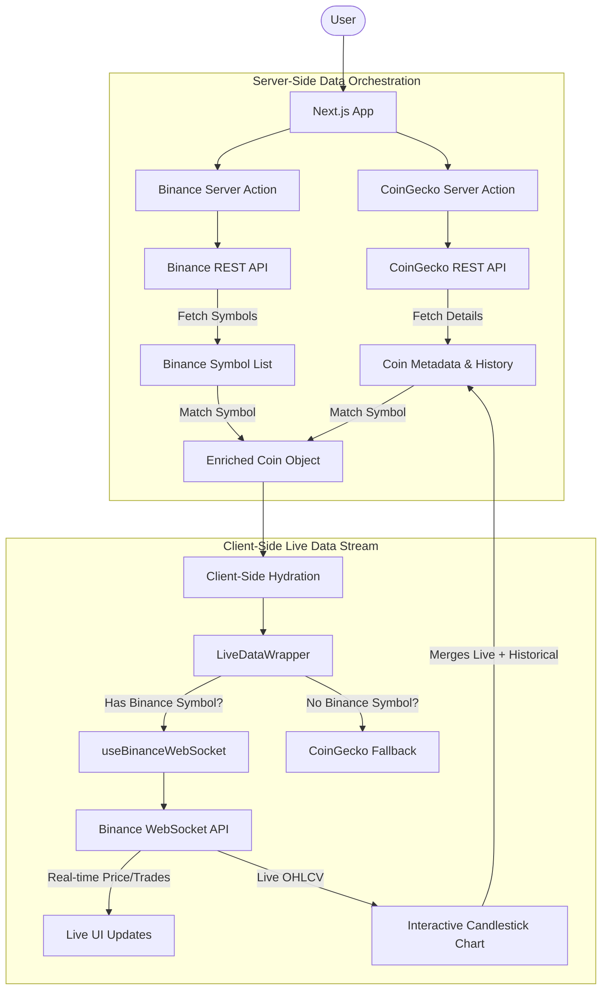

# Crypto Live Dashboard

A high-performance, real-time cryptocurrency tracking platform built with Next.js, integrating both CoinGecko and Binance APIs to deliver a premium trading and analysis experience.

## 🚀 Project Overview

This application provides a comprehensive view of the cryptocurrency market. It combines the deep asset metadata of CoinGecko with the high-frequency trading data of Binance to create a seamless interface for monitoring prices, analyzing trends via candlestick charts, and following live trade feeds.

## 📊 Data Flow Architecture

The project utilizes a multi-provider strategy to ensure both data depth and real-time accuracy.



## 🛠 API Integration Details

### 1. CoinGecko API (The Metadata Backbone)

- **Role:** Primary source for descriptive data.
- **Usage:** Fetches coin names, symbols, high-res icons, and market cap rankings.
- **Historical Context:** Provides the historical OHLCV (Open-High-Low-Close-Volume) data used to populate the charts on load.
- **Fallback:** Serves as the price data source for assets that do not have a corresponding pair on Binance.

### 2. Binance API (The Live Engine)

- **Role:** High-frequency real-time data provider.
- **Symbol Mapping:** On the server, we match CoinGecko symbols with Binance trading pairs (e.g., `BTC` -> `BTCUSDT`) using the Binance Exchange Info API.
- **WebSocket Streams:**
  - `@ticker`: Sub-second price and 24h change updates.
  - `@trade`: Real-time feed of individual trades occurring on the exchange.
  - `@kline`: Live candle building, allowing the chart to update in real-time without refreshing.

## 🏗 Key Components

- **`LiveDataWrapper`**: The orchestration layer that decides whether to initiate a Binance WebSocket or stay on the static CoinGecko feed.
- **`useBinanceWebSocket`**: A custom React hook that manages the WebSocket lifecycle, including connection, error handling, and data parsing.
- **`CandlestickChart`**: A high-performance charting component that seamlessly merges historical arrays from CoinGecko with the incoming live candle from Binance.

## 🚦 Getting Started

### Prerequisites

- Node.js 18+
- CoinGecko API Key

### Installation

1.  Clone the repository:
    ```bash
    git clone https://github.com/vyhoangquocnguyen/crypto-app.git
    ```
2.  Install dependencies:
    ```bash
    npm install
    ```
3.  Set up your environment variables in `.env.local`:
    ```env
    COINGECKO_BASE_URL=https://api.coingecko.com/api/v3
    COINGECKO_API_KEY=your_api_key
    BINANCE_BASE_URL=https://api.binance.com/api/v3
    NEXT_PUBLIC_BINANCE_WS_BASE_URL=wss://stream.binance.com:9443/stream
    ```
4.  Run the development server:
    ```bash
    npm run dev
    ```

Open [http://localhost:3000](http://localhost:3000) to see the live dashboard.
